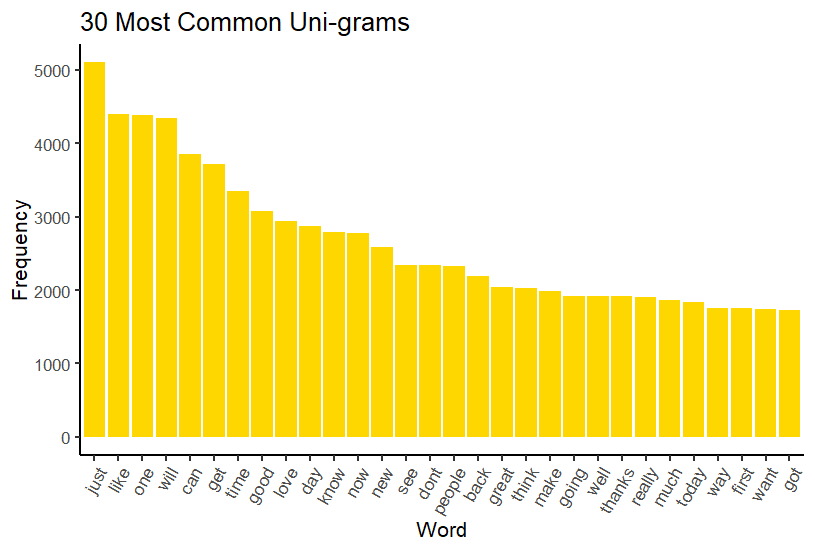
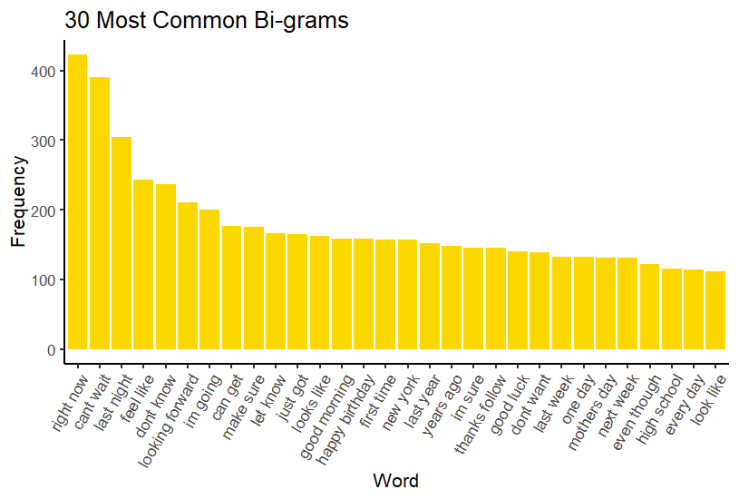
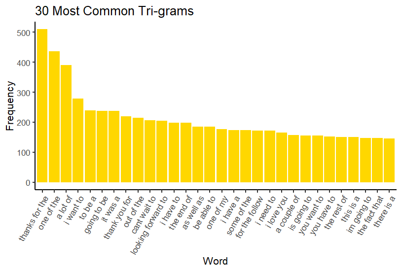

```{r setup, include=FALSE}
knitr::opts_chunk$set(echo = TRUE)
```
## Synopsis

This is the Milestone Report for the Coursera, John Hopkins University Data Science Capstone project. The goal of the capstone project is to develop a predictive text model using a large text corpus of documents as training data, from the Swiftkey company. NLP techniques will be used to perform the analysis and build the predictive model.

This milestone report describes the major features of the training data with our exploratory data analysis. 

## NLP Package Used

The `RWeka` package will be used to find the most frequently occurring words in the data. RWeka is a collection of machine learning algorithms for data mining tasks written in Java, containing tools for data pre-processing, classification, regression, clustering, association rules, and visualization. 

## Getting the data

```{r eval=FALSE}

## Load CRAN modules 
library(downloader)
library(plyr);
library(dplyr)
library(knitr)
library(tm)
library(ggplot2)

#-----Download DataSet-----#
## Check if directory already exists?
if(!file.exists("./projectData")){
  dir.create("./projectData")
}
Url <- "https://d396qusza40orc.cloudfront.net/dsscapstone/dataset/Coursera-SwiftKey.zip"
## Check if zip has already been downloaded in projectData directory?
if(!file.exists("./projectData/Coursera-SwiftKey.zip")){
  download.file(Url,destfile="./projectData/Coursera-SwiftKey.zip",mode = "wb")
}
## Check if zip has already been unzipped?
if(!file.exists("./projectData/final")){
  unzip(zipfile="./projectData/Coursera-SwiftKey.zip",exdir="./projectData")
}
``` 
Once the dataset is downloaded, it is read line by line due to the sheer size of the data set. The data sets consist of text from 3 different sources: 1) News, 2) Blogs and 3) Twitter feeds. In this project, we will only focus on the English - US data sets.
```{r eval=FALSE}
path <- file.path("./projectData/final" , "en_US")
files<-list.files(path, recursive=TRUE)

#-----Opening File Connections to Various Data Sets and obtain Files-----#
# Making file connection of the twitter data set
con <- file("./projectData/final/en_US/en_US.twitter.txt", "r") 
#lineTwitter<-readLines(con,encoding = "UTF-8", skipNul = TRUE)
lineTwitter<-readLines(con, skipNul = TRUE)
# Close the connection handle when you are done
close(con)

# Making file connection of the blog data set
con <- file("./projectData/final/en_US/en_US.blogs.txt", "r") 
#lineBlogs<-readLines(con,encoding = "UTF-8", skipNul = TRUE)
lineBlogs<-readLines(con, skipNul = TRUE)
# Close the connection handle when you are done
close(con)

# Making file connection of the news data set
con <- file("./projectData/final/en_US/en_US.news.txt", "r") 
#lineNews<-readLines(con,encoding = "UTF-8", skipNul = TRUE)
lineNews<-readLines(con, skipNul = TRUE)
# Close the connection handle when you are done
close(con)
```
Summary of dataset (file sizes, line counts, word counts, and mean words per line) are shown below.
```{r eval=FALSE}
library(stringi)
# Get file sizes
lineBlogs.size <- file.info("./projectData/final/en_US/en_US.blogs.txt")$size / 1024 ^ 2
lineNews.size <- file.info("./projectData/final/en_US/en_US.news.txt")$size / 1024 ^ 2
lineTwitter.size <- file.info("./projectData/final/en_US/en_US.twitter.txt")$size / 1024 ^ 2

# Get words in files
lineBlogs.words <- stri_count_words(lineBlogs)
lineNews.words <- stri_count_words(lineNews)
lineTwitter.words <- stri_count_words(lineTwitter)

# Summary of the data sets
data.frame(source = c("blogs", "news", "twitter"),
           file.size.MB = c(lineBlogs.size, lineNews.size, lineTwitter.size),
           num.lines = c(length(lineBlogs), length(lineNews), length(lineTwitter)),
           num.words = c(sum(lineBlogs.words), sum(lineNews.words), sum(lineTwitter.words)),
           mean.num.words = c(mean(lineBlogs.words), mean(lineNews.words), mean(lineTwitter.words)))
```
## Data Cleaning 
This step involves the removal of any URLs, special characters, punctuations, numbers, excess whitespace, stopwords, and changes the text to lower case. Since the data sets are quite large, we will randomly select 2% of the data to demonstrate the data cleaning and exploratory analysis step.
```{r eval=FALSE}
library(tm)
#--------------Cleaning of Data---------------#
# Sample the data
set.seed(5000)
data.sample <- c(sample(lineBlogs, length(lineBlogs) * 0.02),
sample(lineNews, length(lineNews) * 0.02),
sample(lineTwitter, length(lineTwitter) * 0.02))

# Create corpus and clean the data
corpus <- VCorpus(VectorSource(data.sample))
toSpace <- content_transformer(function(x, pattern) gsub(pattern, " ", x))
corpus <- tm_map(corpus, toSpace, "(f|ht)tp(s?)://(.*)[.][a-z]+")
corpus <- tm_map(corpus, toSpace, "@[^\\s]+")
corpus <- tm_map(corpus, tolower)
corpus <- tm_map(corpus, removePunctuation)
corpus <- tm_map(corpus, removeNumbers)
corpus <- tm_map(corpus, stripWhitespace)
corpus <- tm_map(corpus, PlainTextDocument)
unicorpus <- tm_map(corpus, removeWords, stopwords("en"))
```

##Exploratory Data Analysis
In this section, we will identify the most frequently occurring words in the data. Here we will list the most common (n-grams) uni-grams, bi-grams, and tri-grams.
```{r eval = FALSE, message = FALSE}
library(RWeka)
##annotate
options(mc.cores=1)
# Obtain frequencies of the word
getFreq <- function(tdm) {
  freq <- sort(rowSums(as.matrix(tdm)), decreasing = TRUE)
  return(data.frame(word = names(freq), freq = freq))
}
bigram <- function(x) NGramTokenizer(x, Weka_control(min = 2, max = 2))
trigram <- function(x) NGramTokenizer(x, Weka_control(min = 3, max = 3))

#function for histogram plotting
createplot <- function(data, label) { 
  ggplot(data[1:30,], aes(x= reorder(word, -freq), y=freq)) + 
    geom_bar(stat="identity", fill = "Gold") +
    xlab("Word") + ylab("Frequency") + # Set axis labels
    ggtitle(label) +     # Set title
    theme_classic(base_size = 16) +
    theme(axis.text.x=element_text(angle=60,hjust=1))
}

# Get frequencies of the most common n-grams in data sample
freq1 <- getFreq(removeSparseTerms(TermDocumentMatrix(corpus), 0.9999))
freq2 <- getFreq(removeSparseTerms(TermDocumentMatrix(corpus, control = list(tokenize = bigram)), 0.9999))
freq3 <- getFreq(removeSparseTerms(TermDocumentMatrix(corpus, control = list(tokenize = trigram)), 0.9999))
```

Plot of the 30 most common unigrams:

```{r eval = FALSE}
createplot(freq1, "30 Most Common Uni-grams")
```
```{r echo=FALSE, out.width = '100%'}

```

Plot of the 30 most common bigrams:

```{r eval = FALSE}
createplot(freq2, "30 Most Common Bi-grams")
```
```{r echo=FALSE, out.width = '100%'}

```

Plot of the 30 most common trigrams:

```{r  eval = FALSE}
createplot(freq3, "30 Most Common Tri-grams")
```
```{r echo=FALSE, out.width = '100%'}

```

## Conclusion and Future Steps
This concludes the exploratory data analysis. The next steps of this capstone project would be to finalize the predictive algorithm, and deploy our algorithm as a Shiny app.
